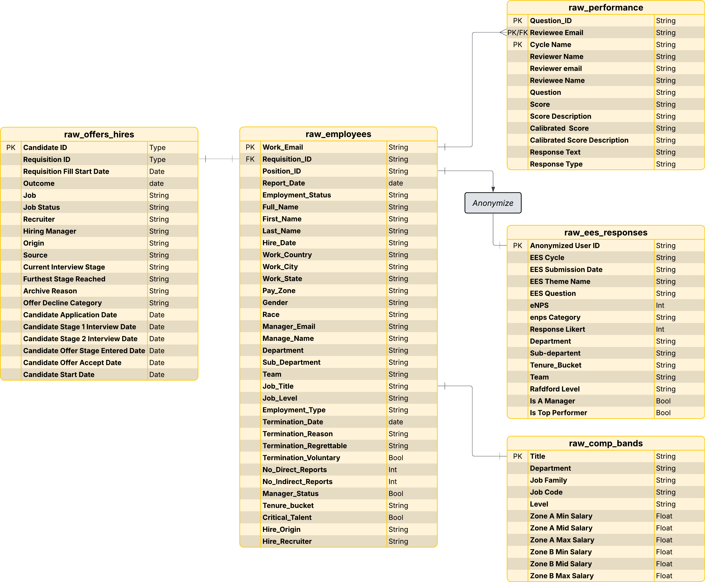
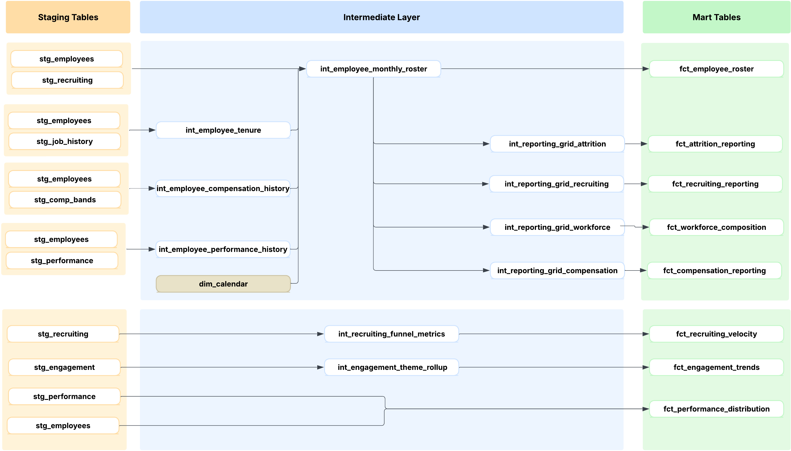

# JustKaizen AI: People Analytics Data Infrastructure

A production-grade People Analytics data warehouse built for **JustKaizen AI**, a pre-IPO enterprise AI company (1,200 active employees, ~1,900 total, remote-first). The project demonstrates end-to-end data infrastructure: source system integration, dbt transformation layers, BigQuery warehouse, automated data delivery, and Tableau-ready reporting marts.

This infrastructure supports the workforce analytics dashboard and insights published in the companion repository: **[JustKaizen Workforce Analytics →](https://github.com/keenanj-analytics/justkaizen-workforce-analytics)** Coming Soon!

## Tools & Stack

| Layer | Technology |
|-------|-----------|
| Data Generation | Python (pandas) |
| Data Warehouse | Google BigQuery |
| Transformation | dbt (29 models across staging, intermediate, and mart layers) |
| Data Delivery | Google Apps Script (BigQuery → Google Sheets, automated) |
| Visualization | Tableau Public |
| AI-Assisted Development | Claude Code (code development, model generation, testing) |
| Version Control | Git / GitHub |

---

## Background

JustKaizen AI's People team faced a common problem: workforce data was spread across five source systems (HRIS, ATS, performance reviews, engagement surveys, compensation bands), each with its own export format, update cadence, and field naming conventions. Monthly reporting required hours of manual CSV exports, spreadsheet joins, and copy-paste assembly. Cross-domain questions ("Are we losing top performers in departments with declining engagement scores?") required building a new analysis from scratch each time.

The goal was to build a centralized data infrastructure where every workforce metric is computed once, in one place, and served to dashboards without manual intervention. The architecture needed to support both standardized monthly reporting and ad-hoc exploratory analysis across any combination of workforce dimensions.

---

## Requirements

Before building anything, I defined the analytical framework using a **Question Cascade**: a structured mapping from stakeholder question → diagnostic metric → benchmark → segmentation path → action trigger. This ensured every table and every column in the warehouse exists because a business question requires it.

Six core business questions drove the architecture:

| Domain | Stakeholder Question |
|--------|---------------------|
| Workforce | Is the organization growing at a healthy rate? Where is growth concentrated? |
| Attrition | Are we losing people faster than we should be? Are we losing the right or wrong people? |
| Hiring | Are we filling roles fast enough? Where is the pipeline breaking down? |
| Compensation | Are we paying equitably within peer cohorts? Where are compa-ratio outliers? |
| Engagement | Which teams are engaged and which are disengaging? What themes are driving the gap? |
| Performance | Is our rating distribution healthy or inflated? Where is top talent concentrated? |

Each question maps to specific metrics, which map to specific columns in specific mart tables. If a metric can't trigger a decision, it doesn't belong in the warehouse.

---

## Data Architecture

### Source Systems

Five source systems feed the warehouse, representing the typical People Analytics data ecosystem:

| Source | What It Provides | Records |
|--------|-----------------|---------|
| HRIS | Employee census: demographics, job info, hire/term dates, manager hierarchy, comp zone | ~65,000+ rows (monthly snapshots) |
| ATS | Recruiting pipeline: candidates, interview stages, offers, hires, sources, recruiters | ~30,000+ rows |
| Performance Management System | Review ratings by cycle, manager reviews, calibrated scores | ~15,000+ rows |
| Engagement Survey | Anonymized employee responses across 27 questions and 8 themes | ~25,000+ rows |
| Compensation Bands | Salary bands by title, zone, and level | ~200+ rows |

### Raw Layer ERD


*(Entity-relationship diagram showing the 5 source tables and their join keys)*

### Pipeline Architecture


*(Data flow from raw sources through staging, intermediate, and mart layers)*

The architecture follows a hub-and-spoke pattern with the **Employee Monthly Roster** as the central table:

```
Raw Sources → Staging (clean/rename) → Helper Intermediates → ROSTER → Reporting Grids → Marts
                                                                  └──→ Drill-through table

Separate paths (anonymized/detail data):
  Recruiting → Funnel Metrics → Recruiting Velocity
  Engagement → Theme Rollup → Engagement Trends
  Performance + Employees → Performance Distribution
```

### Why This Architecture

The most common People Analytics setup is a single wide reporting table that tries to serve every use case. That breaks the moment you need a new dimension or a new metric type. This architecture separates concerns:

**The roster is the single source of truth.** One row per employee per month, with every dimension attached. When someone asks "who left?" the answer comes from one table, not a chain of joins.

**Domain-specific reporting marts serve domain-specific questions.** The attrition mart has termination counts and TTM rates. The compensation mart has compa-ratios and band positions. They share the same employee dimensions because they're both built from the roster, but they carry different metrics because they answer different questions.

**Reporting grids prevent gaps.** A month where Engineering has zero voluntary terminations still gets a row in the attrition mart with a zero. Without this, trend lines break and TTM rolling windows miscalculate.

---

## dbt Transformation

### Model Inventory (29 models)

| Layer | Models | Materialization | Purpose |
|-------|--------|----------------|---------|
| Staging | 6 | View | Clean field names, cast types, apply source-level filters. No joins, no business logic. |
| Intermediate (helpers) | 3 | View | Collapse multi-row source data into one row per employee (latest comp, latest rating, tenure metrics). |
| Intermediate (roster) | 1 | View | The golden record. One row per employee per month. All dimensions as columns. ~65,000-75,000 rows. |
| Intermediate (grids) | 4 | View | Month x dimension scaffolds ensuring no gaps in trend lines. One per reporting domain. |
| Intermediate (other) | 3 | View | Recruiting funnel aggregation, engagement theme rollup, calendar date spine. |
| Marts (reporting) | 4 | Table | Pre-computed metrics with TTM rolling windows and org-wide benchmarks. Tableau reads these directly. |
| Marts (detail) | 4 | Table | Drill-through tables for individual employee, requisition, engagement, and performance detail. |

### Key Transformation Patterns

**Pattern 1: The Employee Monthly Roster**

The roster is built by crossing every employee with every month they were active, then enriching with compensation, performance, and recruiting data:

```sql
-- Core roster construction (simplified)
SELECT
    e.employee_id,
    m.report_month,
    e.department,
    e.sub_department,
    e.job_level,
    CASE
        WHEN e.job_level IN ('P1','P2','P3') THEN 'Junior IC'
        WHEN e.job_level IN ('P4','P5','P6') THEN 'Senior IC'
        WHEN e.job_level IN ('M1','M2') THEN 'Manager'
        WHEN e.job_level IN ('M3','M4') THEN 'Director'
        WHEN e.job_level IN ('E1','E2','E3','E4','E5','E6') THEN 'Senior Leadership'
    END AS level_group,
    c.salary,
    c.comp_band_mid,
    ROUND(c.salary / c.comp_band_mid, 2) AS compa_ratio,
    p.latest_perf_rating_numeric,
    CASE
        WHEN p.latest_perf_rating_numeric >= 4 OR e.is_critical_talent THEN 'Y'
        ELSE 'N'
    END AS top_performer_flag,
    DATE_TRUNC(e.termination_date, MONTH) = m.report_month AS is_terminated_this_month,
    e.termination_reason NOT IN ('Reduction in Force', ...) AS is_attrition_eligible_term
FROM stg_employees e
CROSS JOIN (SELECT DISTINCT report_month FROM dim_calendar) m
LEFT JOIN int_employee_compensation_current c ON e.employee_id = c.employee_id
LEFT JOIN int_employee_performance_history p ON e.employee_id = p.employee_id
WHERE e.hire_date <= LAST_DAY(m.report_month)
  AND (e.termination_date IS NULL OR e.termination_date >= m.report_month)
```

**Pattern 2: TTM Rolling Window Calculations**

Trailing twelve-month attrition rates are computed using window functions with a 12-month averaged denominator that smooths the impact of structural events like layoffs:

```sql
-- TTM attrition rate with averaged denominator
SUM(voluntary_terminations) OVER (
    PARTITION BY department
    ORDER BY report_month
    ROWS BETWEEN 11 PRECEDING AND CURRENT ROW
)
/
AVG(end_month_headcount) OVER (
    PARTITION BY department
    ORDER BY report_month
    ROWS BETWEEN 11 PRECEDING AND CURRENT ROW
)
AS ttm_voluntary_attrition_rate
```

**Pattern 3: Org-Wide Benchmarks on Every Row**

Every reporting mart carries three levels of comparison so any segment can be benchmarked without a second query:

```sql
-- Segment rate alongside department and org-wide benchmarks
ttm_voluntary_attrition_rate,           -- This segment's rate
dept_ttm_voluntary_attrition_rate,      -- Department average
orgwide_ttm_voluntary_attrition_rate    -- Company-wide average
```

In Tableau, this translates to: drag the segment rate as a bar, drag the org-wide rate as a reference line. One data source, no calculated fields.

---

## Data Validation

All models pass dbt tests covering:

| Test Category | What It Validates | Count |
|--------------|-------------------|-------|
| Primary key uniqueness | No duplicate rows at the defined grain | Per model |
| Not null | PKs and critical fields are never NULL | Per model |
| Accepted values | Categorical fields contain only valid values (level groups, tenure buckets, termination types) | Per model |
| Referential integrity | Every manager_id maps to a valid employee_id. Every requisition_id in the roster exists in recruiting. | Cross-model |
| Range checks | Compa-ratios between 0.75 and 1.25. Attrition rates between 0 and 1. Tenure months >= 0. | Per model |
| Sum validation | SUM(department headcounts) = org-wide headcount for every month | Mart-level |

---

## Data Delivery

An automated pipeline delivers mart data from BigQuery to Google Sheets using Apps Script. Tableau Public connects to the Google Sheet via the Google Drive connector.

```
dbt run (rebuilds marts in BigQuery)
    → Apps Script "Refresh All Data" (pulls marts into Google Sheets)
        → Tableau reads from Google Sheets (no manual export)
```

The Apps Script creates one tab per mart table, with formatted headers, auto-sized columns, and a custom menu for one-click refresh. Total refresh time: ~3 minutes for all tables.

---

## What I'd Build Next

**Phase 2: Data Engineering Evolution**

- **Daily employee snapshots** with SCD Type 2 change tracking (slowly changing dimensions). The current architecture uses end-of-month snapshots. Daily snapshots would capture mid-month transfers, promotions, and manager changes with exact effective dates.
- **Incremental models** for the roster and reporting marts. Currently, dbt rebuilds every model from scratch on each run. Incremental materialization would append only new months, reducing build time from minutes to seconds.

---

## Repository Structure

```
people-analytics-data-infrastructure/
├── CLAUDE.md                              ← Project brain file
├── README.md                              ← This file
│
├── docs/
│   ├── JustKaizen_Company_Profile.md      ← Company story, org structure, parameters
│   ├── JustKaizen_Data_Dictionary.md      ← Every field in every model
│   ├── JustKaizen_Model_Dependency_Map.md ← Model connections and join keys
│   ├── JustKaizen_Architecture_Spec.md    ← Full model specifications
│   └── assets/
│       ├── raw_layer_erd.png              ← Source system ERD
│       └── pipeline_flow.png              ← Staging → Intermediate → Mart flow
│
├── scripts/data_generation/               ← Python synthetic data pipeline
│   ├── 01_generate_employee_profiles.py
│   ├── ...
│   └── 13_validate_and_export.py
│
├── seeds/                                 ← Raw CSVs loaded via dbt seed
│   ├── raw_employees.csv
│   ├── raw_performance.csv
│   ├── raw_offers_hires.csv
│   ├── raw_ees_responses.csv
│   └── raw_comp_bands.csv
│
├── models/
│   ├── staging/                           ← 6 stg_* views + schema.yml
│   ├── intermediate/                      ← 12 int_* views + dim_calendar + schema.yml
│   └── marts/                             ← 11 fct_* tables + schema.yml
│
├── dbt_project.yml
└── packages.yml
```

---

## About

Built by **[Keenan Artis](https://www.linkedin.com/in/keenanjeffreyartis/)**, a data analyst with 7+ years across forensics analytics (PwC) and people analytics. This architecture is modeled after a production People Analytics infrastructure I built from scratch as the first analytics hire at a ~950-person tech company, adapted for dbt and BigQuery. dbt models were built using Claude Code as an AI-assisted development tool. Architectural decisions, business logic definitions, data validation criteria, and all analytical frameworks were designed by the author prior to code generation.

**[View the Workforce Analytics Dashboard →](https://github.com/keenanj-analytics/justkaizen-workforce-analytics)** Coming Soon!